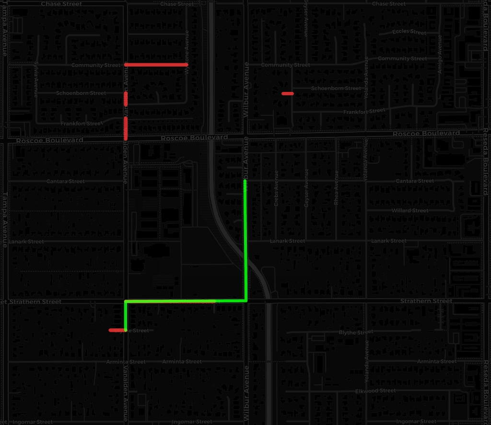

# Orbital Edge: Dynamic Disaster Routing Engine

An end-to-end machine learning and geospatial routing pipeline designed to dynamically redirect emergency vehicles around disaster zones (wildfires, structural collapse, floods) using real-time satellite imagery.



This map is the final output where two distinct systems—Deep Learning and Classical Graph Theory—synchronize. The architecture ingests raw satellite imagery, detects disaster zones, and dynamically modifies the underlying geometry of the city grid to calculate a safe route.

### The Red Lines (AI Sabotage of the Graph)
These represent road segments that have been deemed completely impassable or destroyed.
* **The AI Connection:** The trained U-Net AI model (`disaster_unet.pth`) analyzes a live, post-disaster satellite GeoTIFF. By recognizing the universal visual signatures of destruction (broken geometry, chaotic textures, scorch marks), it generates a high-confidence probability mask (the "stencil").
* **The Sabotage:** The routing engine overlays this stencil onto the live street map. Wherever a street segment intersects with the AI's "danger zone," the engine programmatically amputates that mathematical edge from the geospatial graph, simulating the destruction of physical infrastructure.

### The Green Lines (Dijkstra Pathfinding around Danger)
This is the shortest, mathematically safe alternative route calculated for an emergency responder.
* **The Graph Algorithm Connection:** Once the AI deletes the red roads, the Map Engine (NetworkX) is left with a broken, disconnected network. 
* **The Behavior:** The pathfinding algorithm (`nx.shortest_path`) hits the newly created red walls and dynamically recalculates. It swerves through the surviving street grid to find the optimal path. To ensure the green rescue line can physically connect the start and end points, the AI's "destruction threshold" can be tuned (e.g., rejecting roads only at a 95% damage probability) to prevent the algorithm from being entirely choked out of the neighborhood.

---

## 🧠 Training the Brain (The AI Engine)

The AI is not hardcoded to any specific city. It was trained to understand the universal visual language of destruction using the **xBD Dataset**. 

1. **The Flashcards:** We processed raw satellite images and GeoJSON polygons from global disasters into thousands of paired 256x256 images and black-and-white damage "masks."
2. **The U-Net:** We trained a PyTorch U-Net architecture (`train.py`) from scratch. Over several epochs, the neural network learned to correlate specific pixel clusters with structural damage. 
3. **The Result:** The resulting `disaster_unet.pth` memory file contains the trained weights. It does not memorize geography; it simply scans pixels and identifies damage, whether it is looking at a flood in Jakarta or a wildfire in California.

---

## 🌍 Global, On-The-Fly Deployment

This system is a **globally agnostic routing engine**. It is not restricted to a sandbox. 

1. **The Drop:** Provide the pipeline with a raw, multi-spectral `.tif` (GeoTIFF) from providers like **Vantor, Sentinel, or Maxar**.
2. **The GPS Intercept:** The pipeline uses `rasterio` to silently read the hidden 16-bit metadata inside the `.tif` file, extracting the exact real-world Latitude and Longitude boundaries of the photo.
3. **Dynamic Map Build:** The system passes those coordinates to the OpenStreetMap API (`osmnx`), dynamically downloading the live street graph for that specific footprint anywhere on Earth.
4. **The Sabotage & Rescue:** The AI scans the pixels, severs the roads on the newly downloaded map, and calculates the safe route without a single line of code needing to be changed. 

---

## 🏗 System Architecture

1. **Semantic Segmentation (PyTorch):** A custom-built U-Net architecture trained from scratch that analyzes post-disaster satellite imagery and outputs high-fidelity binary damage masks.
2. **Geospatial Extraction (Rasterio):** Intercepts raw 16-bit satellite GeoTIFFs, scales the scientific light data for AI ingestion, and rips the embedded coordinate boundaries.
3. **Graph Sabotage Engine (OSMnx):** Intercepts OpenStreetMap real-world network data. If the AI detects critical damage at specific geospatial coordinates, the engine programmatically amputates those localized edges from the mathematical graph.
4. **Dynamic Pathfinding (NetworkX):** Executes Dijkstra's algorithm across the surviving graph components to generate the safest alternative route for emergency responders.

---

## ⚙️ Local Setup & Execution

### 1. Initialize the Environment
Clone the repository and install the geospatial and deep learning dependencies.
```bash
git clone [https://github.com/YOUR-USERNAME/disaster-routing.git](https://github.com/YOUR-USERNAME/disaster-routing.git)
cd disaster-routing
python3 -m venv venv
source venv/bin/activate
pip install -r requirements.txt

Data Acquisition & Preparation
Due to size constraints, raw .tif data and the disaster_unet.pth model weights are not hosted in this repository.

Train the model by dropping xBD data into tier3/ and running python prepare_data.py followed by python train.py.

Important TIF Sizing: Raw satellite GeoTIFFs cover massive geographic areas. Pinging the OpenStreetMap API for a 100-mile radius will cause connection timeouts. Use the included crop_tif.py script to isolate a 5% to 10% slice of the disaster zone before running the pipeline.

Run the Global Pipeline
Place your target .tif file into the test_data/ folder and execute the orchestrator:

Bash
python pipeline.py
Output: The system will print the dynamic GPS extraction logs and generate a live_ai_disaster_route.html interactive Folium map in your root directory.